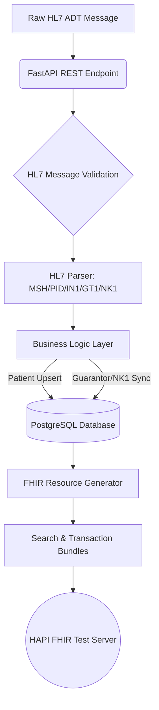

🏥 Healthcare Interoperability Engine

HL7 v2.x ➜ PostgreSQL ➜ FHIR R4 Integration Platform

🚀 Project Overview

Healthcare organizations still exchange millions of messages using the HL7 v2.x standard, while modern healthcare applications are migrating to FHIR. This project acts as an interoperability engine that bridges these two ecosystems by:

Receiving raw HL7 ADT messages.

Parsing and validating the message.

Extracting patient and related information.

Persisting normalized data into PostgreSQL.

Performing intelligent update/insert operations.

Maintaining relationship mappings.

Generating FHIR R4 compliant resources.

Creating Transaction Bundles from Search Set Bundles for HAPI Test Server (R4 FHIR).

The objective is to simulate a real world healthcare integration workflow similar to what exists in enterprise EMR/PM systems.

✨ Key Features

HL7 ADT Message Processing: Supports validation and processing of ADT^A04, ADT^A08, ADT^A28, and ADT^A31. Invalid message types are rejected before processing.

HL7 Segment Extraction: Automatically parses MSH, PID, IN1, GT1, and NK1 segments into structured Python objects.

Patient Master Logic: Searches existing patients using Account Number and DOB, updates matching patients, and creates new patients when no match exists, mimicking a simplified MPI.

Insurance Processing: Creates insurance masters when needed, maps insurance to patients, removes outdated mappings, and maintains a normalized relational design.

Guarantor & Next of Kin Processing: Detects existing guarantors and Next-of-Kin records, synchronizes demographics, creates/manages patient relationships, and keeps them synchronized with incoming HL7.

Audit Logging: Generates detailed audit trails including validation steps, updates, errors, and processing status.

FHIR R4 Resource Generation: Automatically creates Patient, Coverage, and RelatedPerson resources packaged into a FHIR Search Bundle.

Transaction Bundle Generator: Converts Search Bundles into Transaction Bundles for direct consumption by a FHIR server.

HAPI Test Server Integration: Posts generated resources to the public HAPI R4 FHIR test server for interoperability testing.

🏗️ System Architecture

📡 API Endpoints

  

💻 Tech Stack & Database Schema
Core Technologies:

Backend: Python, FastAPI, HTTPX

Database: PostgreSQL, SQLAlchemy ORM, Alembic

Healthcare Standards: HL7 v2.x, FHIR R4

Database Schema (PostgreSQL):
patient_demographics, insurance_master, insurance_demographics, next_to_kin, next_to_kin_patient_relation, guarantor_demographics, guarantor_Patient_relation, relation_codes, hl7datalog.

⚙️ Setup & Installation Guide
Prerequisites: Python 3.11 or later, PostgreSQL, Git.

1) Install Required Libraries:
  
       pip install fastapi uvicorn sqlalchemy psycopg2-binary hl7 fhir.resources httpx alembic

3) Database Configuration:
  
    Create a database named HL7_FHIR.  
    Modify the database connection string in database.py:
   
       postgresql://<user>:<password>@localhost:5432/HL7_FHIR
    Run migrations or initialize the schema.  

3) Run the Application:

       uvicorn main:app --reload    
    Open Swagger UI at (http://127.0.0.1:8000/docs) to interact with the endpoints

🔮 Future Enhancements & Learning Outcomes
    Roadmap:
    
**HL7**: Support ORU, ORM, and SIU messages.  
**FHIR**: Expand to Practitioner, Organization, Encounter, and Observation resources.

Skills Demonstrated: HL7 Parsing, FHIR Resource Modeling, Enterprise Backend Development, Healthcare Integration, SQLAlchemy ORM, FastAPI, PostgreSQL, REST API Design, Data Normalization, Transaction Bundle Generation.

Developed by Anand Patel ©
